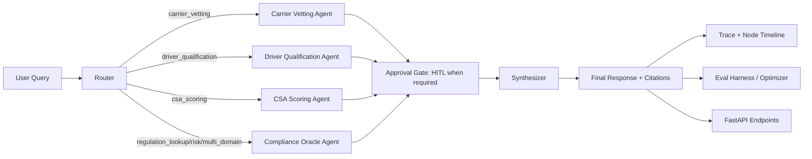

# RigCompass AI

Multi-agent transportation compliance intelligence for FMCSA, DOT, CSA, and CFR workflows.

## What This Project Delivers

RigCompass turns high-stakes compliance questions into evidence-backed recommendations with citations, traceability, and human approval controls where needed.

Core outcome:
- Not just question answering.
- A decision-support system with provenance, specialist routing, evaluation, and auditability.

## Architecture (All Stages)

### Stage 1: System of Understanding

Purpose:
- Convert regulations, inspections, and operational documents into searchable, typed evidence.

What is implemented:
- Text/PDF/image/audio-transcript ingestion.
- Semantic retrieval via ChromaDB.
- Knowledge graph context for carriers, drivers, violations, regulations.
- Source provenance typing via source_type:
  - regulation
  - guidance
  - policy
  - inspection

### Stage 2: System of Velocity

Purpose:
- Route each query to the right specialist and produce actionable output quickly.

What is implemented:
- LangGraph orchestrator with specialist agents.
- Router -> specialist -> synthesizer flow.
- API-first runtime via FastAPI.
- Async ingestion jobs for heavier ingestion workloads.
- HITL interrupt/resume flow with checkpointed thread state.

### Stage 3: System of Continuous Improvement

Purpose:
- Make quality measurable and improve behavior safely over time.

What is implemented:
- Agent tracing to JSONL.
- Node-level orchestration timeline metadata.
- Eval harness with 29 cases across major compliance categories.
- Evaluator-optimizer endpoint for response quality rewrite pass.
- DQF auditor module for rule-linked missing/stale checks and next steps.

## Precise System Figure



## Project Structure

```text
on-moving-things/
├── README.md
├── pyproject.toml
├── data/
│   ├── regulations/
│   └── mock/
├── demo/
│   ├── cli.py
│   └── project_demo.sh
├── evals/
│   ├── test_unit.py
│   └── results/
└── src/
    ├── agents/
    ├── api/
    │   ├── main.py
    │   └── ingest_jobs.py
    ├── compliance/
    │   ├── __init__.py
    │   └── dqf.py
    ├── eval/
    ├── graph/
    │   └── orchestrator.py
    ├── knowledge/
    │   └── ingester.py
    ├── models/
    └── observability/
        └── tracer.py
```

## Installation

```bash
python3.11 -m venv .venv
source .venv/bin/activate
pip install -e ".[dev]"
cp .env.example .env
# set ANTHROPIC_API_KEY in .env
```

## UI Setup and Run

```bash
source .venv/bin/activate
uvicorn src.api.main:app --reload
```

UI endpoints:
- Swagger UI: http://localhost:8000/docs
- ReDoc: http://localhost:8000/redoc

## One-Command Capability Demo

```bash
source .venv/bin/activate
./demo/project_demo.sh
```

This runs:
- LangGraph architecture export.
- HITL start/resume flow.
- DQF audit endpoint.
- Async ingest job.
- Quick eval sample.

## API Surface (Key Endpoints)

Compliance and orchestration:
- POST /v1/compliance/query
- POST /v1/compliance/query/optimized
- POST /v1/compliance/query/hitl
- POST /v1/compliance/query/hitl/{thread_id}/resume
- GET /v1/compliance/query/hitl/{thread_id}

Observability and graph:
- GET /v1/observability/stats
- GET /v1/observability/traces
- GET /v1/observability/traces/{trace_id}
- GET /v1/graph/architecture
- GET /v1/graph/carrier/{dot_number}
- GET /v1/graph/driver/{license_number}

Ingestion:
- POST /v1/ingest/text
- POST /v1/ingest/pdf
- POST /v1/ingest/image
- POST /v1/ingest/audio
- POST /v1/ingest/inspection
- POST /v1/ingest/jobs
- GET /v1/ingest/jobs/{job_id}
- GET /v1/ingest/jobs

Compliance ops:
- POST /v1/dqf/audit
- POST /v1/eval/run
- GET /v1/eval/cases

## Demo Queries (All Possibilities)

### A) Core Compliance Query

```bash
curl -s -X POST http://localhost:8000/v1/compliance/query \
  -H "Content-Type: application/json" \
  -d '{"query":"Run a full safety check on DOT 2345678"}'
```

### B) Optimized Evaluator Pass

```bash
curl -s -X POST http://localhost:8000/v1/compliance/query/optimized \
  -H "Content-Type: application/json" \
  -d '{"query":"Assess DOT 2345678 for high-value hazmat load risk"}'
```

### C) HITL Interrupt and Resume

```bash
curl -s -X POST http://localhost:8000/v1/compliance/query/hitl \
  -H "Content-Type: application/json" \
  -d '{"query":"Should we approve DOT 2345678 for hazmat today?"}'

curl -s -X POST http://localhost:8000/v1/compliance/query/hitl/<THREAD_ID>/resume \
  -H "Content-Type: application/json" \
  -d '{"approved": true, "reviewer_note": "Approved after manual review"}'

curl -s http://localhost:8000/v1/compliance/query/hitl/<THREAD_ID>
```

### D) DQF Auditor

```bash
curl -s -X POST http://localhost:8000/v1/dqf/audit \
  -H "Content-Type: application/json" \
  -d '{
    "packet": {
      "employment_application": true,
      "mvr_initial": false,
      "mvr_annual_review_date": "2024-01-10",
      "medical_certificate_expiration": "2025-01-05",
      "road_test_or_cdl_copy": true,
      "clearinghouse_preemployment_query": false
    }
  }'
```

### E) Multimodal Ingestion

```bash
# text
curl -s -X POST "http://localhost:8000/v1/ingest/text?text=49%20CFR%20395.3(a)(1)%20driving%20limit&title=HOS%20Rule&source_type=regulation"

# pdf
curl -s -X POST "http://localhost:8000/v1/ingest/pdf?path=/absolute/path/to/file.pdf&category=REGULATION&source_type=regulation"

# image
curl -s -X POST "http://localhost:8000/v1/ingest/image?path=/absolute/path/to/scan.png&category=INSPECTION&source_type=inspection"

# audio transcript
curl -s -X POST "http://localhost:8000/v1/ingest/audio?transcript=Driver%20call%20notes%20about%20HOS&title=Call%20Transcript&source_type=guidance"
```

### F) Async Ingestion Jobs

```bash
curl -s -X POST "http://localhost:8000/v1/ingest/jobs?modality=text&source=49%20CFR%20391.23%20MVR%20requirement&category=REGULATION"
curl -s "http://localhost:8000/v1/ingest/jobs/<JOB_ID>"
curl -s "http://localhost:8000/v1/ingest/jobs?n=10"
```

### G) Architecture + Trace Introspection

```bash
curl -s http://localhost:8000/v1/graph/architecture
curl -s http://localhost:8000/v1/observability/stats
curl -s http://localhost:8000/v1/observability/traces
curl -s http://localhost:8000/v1/observability/traces/<TRACE_ID>
```

## Why This Architecture Works

- It distinguishes evidence type and provenance, not just embeddings.
- It keeps sensitive decisions human-controlled via checkpointed HITL.
- It is modular enough to evolve quickly without rewriting the stack.
- It has measurable feedback loops via traces, timelines, and evals.

## Test

```bash
source .venv/bin/activate
python -m pytest evals/test_unit.py -q
```
